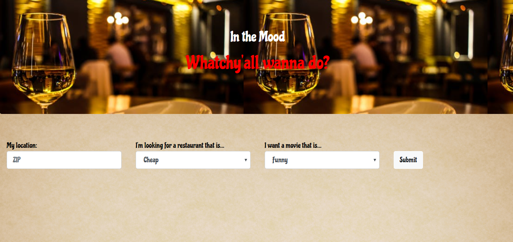

# In The Mood

 
# Overview
Need help figuring out what to do? Tired of information overload? In The Mood will take in limited info and return one result. Don't like it? TOO BAD! J/K, just click "Submit" again for a different option!

This app includes front-end UI/UX using HTML/CSS and D3, AJAX, and Yelp! & Google API's.  

## Walkthrough
To use In The Mood, allow the app to identify your location (GoogleMaps API) then select your preferences from the dropdown. Click "Submit" to get your results.

## Getting Started

1.  [Using In The Mood](#using-inthemood)
2.  [Navigation](#navigation)
3.  [Next Steps](#next-steps)
4.  [Architecture](#architecture)
5.  [Credits and Collaborations](#credits-and-collaborations)

## Using In The Mood

To use In The Mood, allow the app to identify your location (GoogleMaps API) then select your preferences from the dropdown. Click "Submit" to get your results.

## Navigation

Enter navigation info here.

## Next Steps

Next, we would like to add the ability to increase the search radius.

## Architecture

This application was deployed with the following technologies:

Node.js, JavaScript, Express, Heroku, HTML/CSS, and Handlebars.

## Credits and Collaborations

Collaborators: [Colin McPike](https://github.com/therealmcp) , [Derek Rutter](https://github.com/rutterer) , [Mona Rahmani](https://github.com/monarahmani) , [Andrii Gorlushko](https://github.com/andrgor1)

Special thanks to the Full Stack Flex UW Coding Bootcamp instructional staff who assisted us with this project. 
